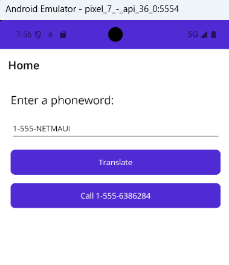
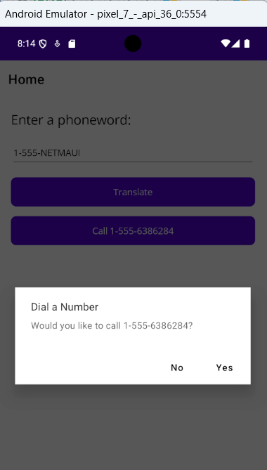
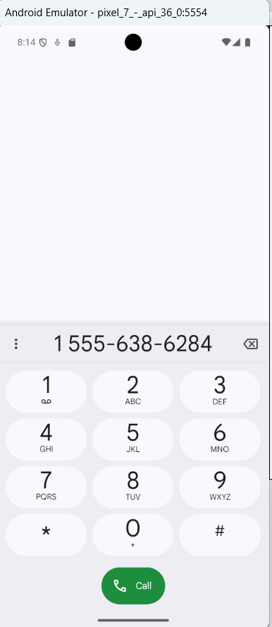

# 📱 PhoneWord — .NET MAUI Exercise

A cross-platform mobile application built with **.NET MAUI** (Multi-platform App UI) as part of the official [Microsoft Learn](https://learn.microsoft.com/en-us/dotnet/maui/) training path. The app converts an alphanumeric phone number (e.g. `1-888-GET-HELP`) into a standard numeric phone number and allows the user to dial it.

---

## 🧰 Prerequisites

Before starting, make sure you have the following installed:

- [Visual Studio 2022](https://visualstudio.microsoft.com/) (v17.3+) with the **.NET Multi-platform App UI development** workload
- [.NET 7 SDK](https://dotnet.microsoft.com/download) or later
- Android Emulator **or** a physical device for testing
- (Optional) Xcode on macOS for iOS deployment

---

## 🚀 Exercise Steps

### Step 1 — Create a New .NET MAUI Project

1. Open **Visual Studio 2022**.
2. Click **Create a new project**.
3. Search for **".NET MAUI App"** and select it, then click **Next**.
4. Name the project `Phoneword` and choose a location, then click **Create**.
5. Visual Studio scaffolds the default MAUI project with `MainPage.xaml` and `MauiProgram.cs`.

---

### Step 2 — Update the UI in `MainPage.xaml`

Replace the default content inside `<ContentPage>` with a custom layout containing:

- A `Label` for instructions
- An `Entry` field for the user to type the alphanumeric phone number
- A `Button` to trigger the translation
- A second `Button` to call the translated number (initially hidden)

```xml
<ContentPage xmlns="http://schemas.microsoft.com/dotnet/2021/maui"
             xmlns:x="http://schemas.microsoft.com/winfx/2009/xaml"
             x:Class="Phoneword.MainPage">

    <VerticalStackLayout Spacing="15" Padding="20">

        <Label Text="Enter a Phoneword:" FontSize="18" />

        <Entry x:Name="phoneNumberText"
               Text="1-855-XAMARIN" />

        <Button x:Name="translateButton"
                Text="Translate"
                Clicked="OnTranslate" />

        <Button x:Name="callButton"
                Text="Call"
                IsEnabled="false"
                Clicked="OnCall" />

    </VerticalStackLayout>

</ContentPage>
```

---

### Step 3 — Add the Translation Logic

Create a new class file `PhoneTranslator.cs` in the project root with a static method that maps letters to their keypad digits:

```csharp
public static class PhoneTranslator
{
    public static string ToNumber(string raw)
    {
        if (string.IsNullOrWhiteSpace(raw))
            return string.Empty;

        raw = raw.ToUpperInvariant();
        var newNumber = new System.Text.StringBuilder();

        foreach (var c in raw)
        {
            if (char.IsDigit(c) || c == '+' || c == '-')
                newNumber.Append(c);
            else if (char.IsLetter(c))
                newNumber.Append(TranslateChar(c));
        }

        return newNumber.ToString();
    }

    static char TranslateChar(char c) => c switch
    {
        'A' or 'B' or 'C' => '2',
        'D' or 'E' or 'F' => '3',
        'G' or 'H' or 'I' => '4',
        'J' or 'K' or 'L' => '5',
        'M' or 'N' or 'O' => '6',
        'P' or 'Q' or 'R' or 'S' => '7',
        'T' or 'U' or 'V' => '8',
        'W' or 'X' or 'Y' or 'Z' => '9',
        _ => c
    };
}
```

---

### Step 4 — Wire Up the Code-Behind in `MainPage.xaml.cs`

Update `MainPage.xaml.cs` to handle the button events:

```csharp
public partial class MainPage : ContentPage
{
    string translatedNumber;

    public MainPage()
    {
        InitializeComponent();
    }

    void OnTranslate(object sender, EventArgs e)
    {
        translatedNumber = PhoneTranslator.ToNumber(phoneNumberText.Text);
        if (!string.IsNullOrWhiteSpace(translatedNumber))
        {
            callButton.IsEnabled = true;
            callButton.Text = $"Call {translatedNumber}";
        }
        else
        {
            callButton.IsEnabled = false;
            callButton.Text = "Call";
        }
    }

    async void OnCall(object sender, EventArgs e)
    {
        if (await DisplayAlert(
                "Dial a Number",
                $"Would you like to call {translatedNumber}?",
                "Yes", "No"))
        {
            try
            {
                if (PhoneDialer.Default.IsSupported)
                    PhoneDialer.Default.Open(translatedNumber);
            }
            catch (FeatureNotSupportedException)
            {
                await DisplayAlert("Error", "Phone dialing is not supported on this device.", "OK");
            }
        }
    }
}
```

---

### Step 5 — Configure App Permissions (Android)

To allow the app to initiate phone calls on Android, add the `CALL_PHONE` permission to `Platforms/Android/AndroidManifest.xml`:

```xml
<uses-permission android:name="android.permission.CALL_PHONE" />
```

---

### Step 6 — Run the App

1. Select an **Android Emulator** (or connected device) from the target dropdown in Visual Studio.
2. Press **F5** or click **▶ Run**.
3. The app launches, enter a phoneword (e.g. `1-855-XAMARIN`), tap **Translate**, then tap the **Call** button to trigger the dialer.

---

## 📸 Screenshots


| Home Screen | After Translation | Call Confirmation |
|:-----------:|:-----------------:|:-----------------:|
|  |  |  |

---

## 📁 Project Structure

```
Phoneword/
├── MauiProgram.cs           # App entry point & service registration
├── MainPage.xaml            # UI layout
├── MainPage.xaml.cs         # Code-behind / event handlers
├── PhoneTranslator.cs       # Letter-to-digit translation logic
├── Platforms/
│   ├── Android/
│   │   └── AndroidManifest.xml
│   ├── iOS/
│   └── ...
├── Resources/
│   ├── AppIcon/
│   ├── Fonts/
│   └── Images/
└── Phoneword.csproj
```

---

## 📚 Reference

- [Microsoft Learn — Build a mobile app with .NET MAUI](https://learn.microsoft.com/en-us/training/paths/build-apps-with-dotnet-maui/)
- [.NET MAUI Documentation](https://learn.microsoft.com/en-us/dotnet/maui/)
- [PhoneDialer API](https://learn.microsoft.com/en-us/dotnet/maui/platform-integration/communication/phone-dialer)

---

## 🪪 License

This project is for educational purposes, following the official Microsoft Learn exercise.